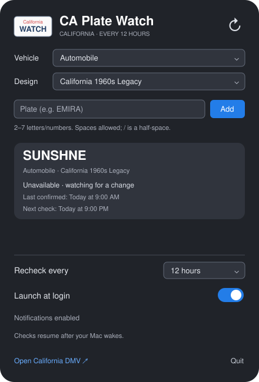

# CA Plate Watch

A native macOS menu bar app that watches California personalized license plates and alerts you when a plate becomes available. Built with Swift and SwiftUI.

**Unofficial project. Not affiliated with or endorsed by the California DMV.**



*Interface illustration with an example plate.*

## Features

- Add and remove plates from a saved watchlist.
- Check each plate automatically every six hours.
- Recheck all plates using the refresh icon at the top right.
- Receive macOS notifications for newly available plates.
- See availability alerts directly in the custom license plate menu bar icon.
- Optionally launch at login.

## Download and install

Download the ZIP for your Mac from the [GitHub Releases page](https://github.com/danvuquoc/ca-plate-watch/releases):

- **arm64** — Apple Silicon (M-series)
- **x86_64** — Intel

Unzip and move **CA Plate Watch.app** to Applications. These builds are **ad-hoc signed and not notarized**. If macOS blocks the first launch and you trust the download, try opening it once, then select **System Settings → Privacy & Security → Open Anyway** and confirm. Managed Macs may restrict this option. See [Apple's instructions](https://support.apple.com/en-us/102445). Do not disable Gatekeeper globally or override an actual malware warning.

Open the app from Applications, then use its menu bar icon to enable notifications and launch at login. Checksums are included with release downloads.

## Build from source

Requires macOS 13 or later and a Swift 6 or newer toolchain, provided by a compatible version of Xcode or Apple's Command Line Tools. No Apple Developer membership is needed to build it locally.

1. Clone or download this repository and open Terminal in its folder.
2. Build the app:

   ```sh
   ./scripts/build-app.sh
   ```

3. Move `dist/CA Plate Watch.app` to `/Applications` or `~/Applications`.
4. Open the app and click its license plate icon in the menu bar.
5. Enable notifications and, optionally, **Launch at login**.

The build is locally ad-hoc signed and targets your Mac's architecture. It does not produce a notarized download. CI builds and runs offline tests on Apple Silicon and Intel runners; the macOS 13 minimum still needs validation on a machine running that version.

## Usage

Enter a plate with 2–7 letters, numbers, or spaces. Letters are capitalized; `/` represents a half-space. New plates are checked immediately.

The refresh icon checks every saved plate and shows a spinner while working. It is disabled during checks and when the watchlist is empty. Each plate's next automatic check is six hours after its most recent attempt.

The menu bar plate displays **CA** normally, a **checkmark and unread count** for new availability, and an **exclamation mark** for check errors. Use **Mark availability alerts as seen** to clear the unread indicator. Repeated available results do not send duplicate alerts.

## Limits

- Supports standard personalized auto plates (Environmental design). Other designs and motorcycles are not configured.
- The app must be running, and your Mac must be awake and online. Overdue checks resume once after wake or launch; the app does not wake your Mac.
- Failed checks retain the last confirmed result and retry after six hours.
- Availability is not a reservation or final approval. Use **Open California DMV** to order.

## Privacy and local data

Plate queries go directly from your Mac to the California DMV over HTTPS. There is no app-operated server, analytics, advertising, or telemetry.

The watchlist and check timestamps are stored locally at:

```text
~/Library/Application Support/CA Plate Watch/watchlist.json
```

These files are outside the repository and are not included in builds. Earlier local versions' watchlists are imported automatically without overwriting an existing watchlist. The updated app identity may require you to allow notifications and enable launch at login again.

## Development

```sh
# Offline tests; no requests to DMV
swift run CAPlateWatchCoreTests

# Build a runnable app bundle
./scripts/build-app.sh

# Optional: make one real DMV lookup for the example plate EMIRA
CA_PLATE_WATCH_LIVE_TEST=1 swift run CAPlateWatchCoreTests
```

The test runner works with Command Line Tools alone and does not require XCTest. Tests cover validation, scheduling, persistence, availability transitions, response handling, and the request flow using a local stub. GitHub Actions runs offline tests and verifies the app bundle on pushes and pull requests.

Source modules are `CAPlateWatch` (app/UI) and `CAPlateWatchCore` (plate model and DMV client). Quit the running app before replacing an installed build.

For contributions, describe the change, keep it focused, and include relevant test results. When reporting an issue, include the macOS version, app version, and reproduction steps. Remove personal plate choices or other private information from screenshots and logs.

## Preparing a release

```sh
./scripts/package-release.sh
```

This cross-compiles separate Apple Silicon and Intel apps, ad-hoc signs them, verifies the signatures after ZIP extraction, and writes versioned ZIPs plus `SHA256SUMS.txt` to `dist/release/`. Generated downloads stay out of Git.

The version in `scripts/build-app.sh` must match the Git tag (for example, `v0.3.0`). Pushing a version tag triggers the release workflow, which tests and packages both builds and attaches them to a draft GitHub Release. Review the notes and publish the draft when ready. Signing credentials are not required.

## Uninstall

Turn off **Launch at login**, quit the app, and move it to Trash. To remove saved plates too, delete the `CA Plate Watch` folder under `~/Library/Application Support`. A backup from an earlier local version may remain in its original folder.

## License

[MIT](LICENSE).
